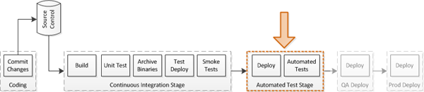

class: center, middle, inverse

# acceptance test
.footnote[[[ThoughtWorks & Wotif]]()]

---
class: center, middle, inverse

# acceptance test .red[vs] functional test
<!-- functional testing: This is a verification activity; did we build a correctly working product? Does the software meet the business requirements?

For this type of testing we have test cases that cover all the possible scenarios we can think of, even if that scenario is unlikely to exist "in the real world". When doing this type of testing, we aim for maximum code coverage. We use any test environment we can grab at the time, it doesn't have to be "production" caliber, so long as it's usable.

acceptance testing: This is a validation activity; did we build the right thing? Is this what the customer really needs?

This is usually done in cooperation with the customer, or by an internal customer proxy (product owner). For this type of testing we use test cases that cover the typical scenarios under which we expect the software to be used. This test must be conducted in a "production-like" environment, on hardware that is the same as, or close to, what a customer will use. This is when we test our "ilities":

Reliability, Availability: Validated via a stress test.

Scalability: Validated via a load test.

Usability: Validated via an inspection and demonstration to the customer. Is the UI configured to their liking? Did we put the customer branding in all the right places? Do we have all the fields/screens they asked for?

Security (aka, Securability, just to fit in): Validated via demonstration. Sometimes a customer will hire an outside firm to do a security audit and/or intrusion testing.

Maintainability: Validated via demonstration of how we will deliver software updates/patches.

Configurability: Validated via demonstration of how the customer can modify the system to suit their needs.

This is by no means standard, and I don't think there is a "standard" definition, as the conflicting answers here demonstrate. The most important thing for your organization is that you define these terms precisely, and stick to them. -->
---
class: center, middle, inverse

# How much should we write?

<!-- have a balanced set of automated tests across all levels, with a disciplined approach to having a larger number of smaller specific automated unit/component tests and a smaller number of larger general end-to-end automated tests to ensure all the units and components work together. (My diagram below with attribution). Having just one level of tests, as shown by the stories above, doesn’t work (but if it did I would rather automated unit tests). Just like having a diet of just chocolate doesn’t work, nor does a diet that deprives you of anything sweet or enjoyable (but if I had to choose I would rather a diet of healthy food only than a diet of just chocolate).

Now if we could just convince Salesforce to be more like Airbus and not fly a complete plane (or 50,000 planes) to test everything every-time they make a change and stop David from continuing on his anti-unit pro-system testing anti-intellectual rampage which will result in more damage to our industry than it’s worth.
 -->
---
class: center, middle, inverse

# automated acceptance tests in continuous delivery

---
class: center, middle, inverse
# CD isn't possible without significant levels of automation

<!-- If your acceptance tests break, that's a sign that you're missing one or more unit tests, so part of CD involves constantly improving your test coverage to try and find bugs earlier in the delivery process where the tests are more fine-grained and the bugs are cheaper to fix. 

- fast feedback loops
- feedback along the deployment pipeline/portability
- reduced testing cycle time
- better time allocation

-->

---
class: center, middle, inverse
# flavors of acceptance tests

---
class: center, middle, inverse
# automated test scripts

---
class: center, middle, inverse
# cucumber

---
class: center, middle, inverse
# specification by example

---
class: center, middle, inverse
# Specifications, not scripts
# Abstract
# Edge cases
# Key examples
# End-to-End flows: 1-3 flows
# Accessible

<!-- Specifications, not scripts: she should move to less workflow based scenarios but more specifications about what is needed, as these are easier to understand, more precise and testable;
Abstract: the specification should be abstract enough to highlight the detail, remove the noise, and not being tied to the implementation of the user interface;
Ubiquitous language: the language used by the team and specifications should be consistent throughout the development process to ensure a shared understanding;
Edge cases: unusual variances should be specified to ensure clarity of expectations: “things that seem obvious kill us, if something sounds obvious, that’s where the danger is”;
Key examples: each decision point should have 5 - 6 key examples, and not more, so it is clear what is expected. These can be created by focussing on the differences between existing scenarios;
End-to-End flows: only a few (1-3) end-to-end flows, not a combination of every decision point combination
Accessible: publishing the specifications so Janet, Dave and others can easily access the latest versions. -->

---
class: center, middle, inverse
# living documentation
## better collaboration: BA + tester + dev
## easier to maintain
## one source of truth
## executable specifications

---
class: center, middle, inverse
# lemming makes it eaiser
## a service for test data creation

