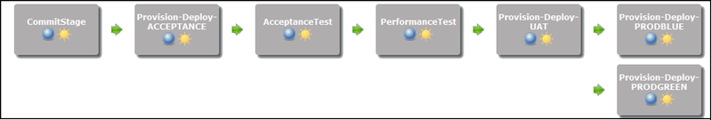
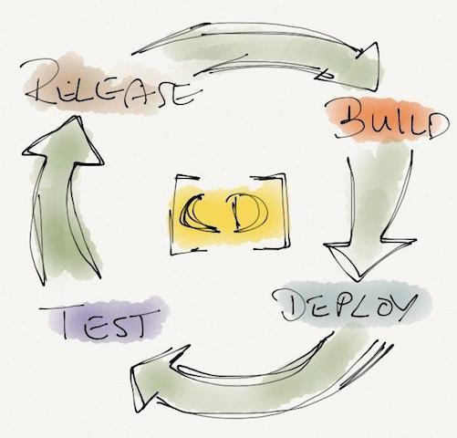
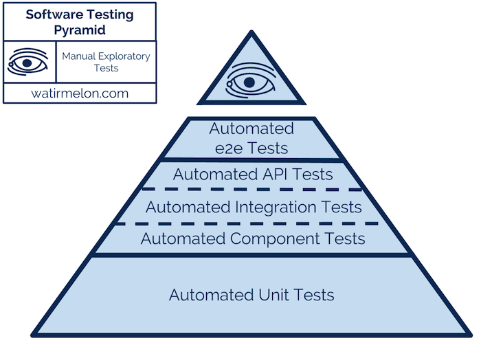
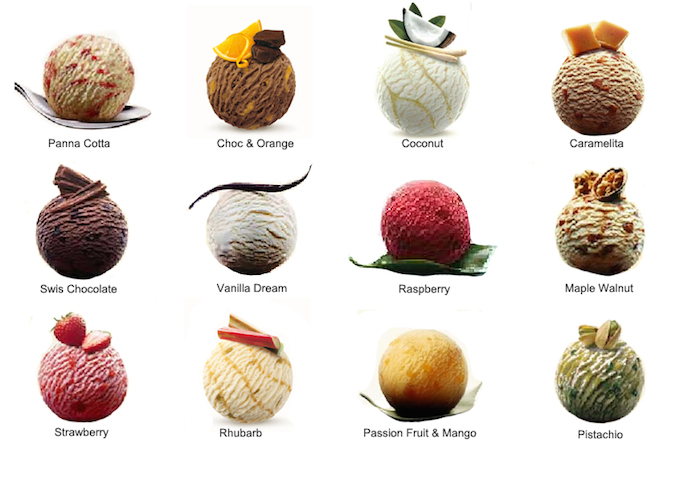
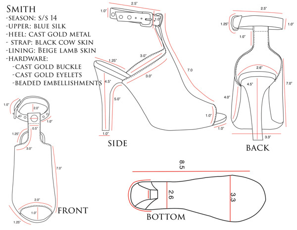
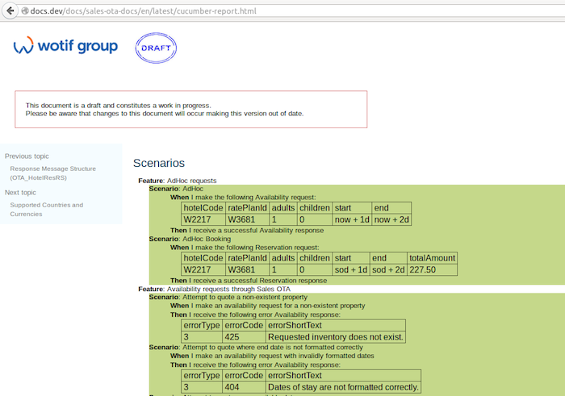
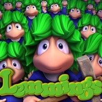
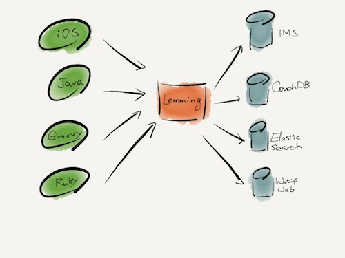
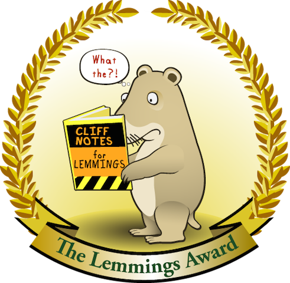

class: center, middle, inverse

# automated acceptance tests
.footnote[[[ThoughtWorks & Wotif]]()]

---
class: center, middle, inverse

# acceptance test .red[vs] functional test
## [validation .red[vs] verification]
<!-- functional testing: This is a verification activity; did we build a correctly working product? Does the software meet the business requirements?

For this type of testing we have test cases that cover all the possible scenarios we can think of, even if that scenario is unlikely to exist "in the real world". When doing this type of testing, we aim for maximum code coverage. We use any test environment we can grab at the time, it doesn't have to be "production" caliber, so long as it's usable.

acceptance testing: This is a validation activity; did we build the right thing? Is this what the customer really needs?

This is usually done in cooperation with the customer, or by an internal customer proxy (product owner). For this type of testing we use test cases that cover the typical scenarios under which we expect the software to be used. This test must be conducted in a "production-like" environment, on hardware that is the same as, or close to, what a customer will use. This is when we test our "ilities":

Reliability, Availability: Validated via a stress test.

Scalability: Validated via a load test.

Usability: Validated via an inspection and demonstration to the customer. Is the UI configured to their liking? Did we put the customer branding in all the right places? Do we have all the fields/screens they asked for?

Security (aka, Securability, just to fit in): Validated via demonstration. Sometimes a customer will hire an outside firm to do a security audit and/or intrusion testing.

Maintainability: Validated via demonstration of how we will deliver software updates/patches.

Configurability: Validated via demonstration of how the customer can modify the system to suit their needs.

This is by no means standard, and I don't think there is a "standard" definition, as the conflicting answers here demonstrate. The most important thing for your organization is that you define these terms precisely, and stick to them. -->
---
class: center, middle, inverse

# automated acceptance tests in continuous delivery


---
class: center, middle, inverse
# CD isn't possible without significant levels of automation


<!-- If your acceptance tests break, that's a sign that you're missing one or more unit tests, so part of CD involves constantly improving your test coverage to try and find bugs earlier in the delivery process where the tests are more fine-grained and the bugs are cheaper to fix. 

- fast feedback loops
- feedback along the deployment pipeline/portability
- reduced testing cycle time
- better time allocation

-->

---
class: center, middle, inverse

# How much should we write?


<!-- have a balanced set of automated tests across all levels, with a disciplined approach to having a larger number of smaller specific automated unit/component tests and a smaller number of larger general end-to-end automated tests to ensure all the units and components work together. (My diagram below with attribution). Having just one level of tests, as shown by the stories above, doesn’t work (but if it did I would rather automated unit tests). Just like having a diet of just chocolate doesn’t work, nor does a diet that deprives you of anything sweet or enjoyable (but if I had to choose I would rather a diet of healthy food only than a diet of just chocolate).

Now if we could just convince Salesforce to be more like Airbus and not fly a complete plane (or 50,000 planes) to test everything every-time they make a change and stop David from continuing on his anti-unit pro-system testing anti-intellectual rampage which will result in more damage to our industry than it’s worth.
 -->

---
class: center, middle, inverse
# flavors of acceptance tests


---
class: center, middle, inverse
# automated test scripts
.left[
```script
open "htt p://beautifultea.com"
assertTitle "Beautiful Tea"
pause "2000"
clickAndWait "link=Teas"
pause "3000"
assertTitle "Range of Teas"
clickAndWait "link=Byron Breakfast"
assertTitle "Byron Breakfast"
click "//input[@name='buy' and @value='1']"
type "quantity", "6"
clickAndWait "//input[@value='Add to cart']"
assertTitle "Beautiful Tea Cart"
```
]

---
class: center, middle, inverse
# cucumber
.left[
```ruby
Feature: Beautiful Tea Shipping

Scenario: Free shipping in Australia
Given I am on the Beautiful Tea home page
When I search for ‘Byron Breakfast’ tea
Then I see the page for ‘Byron Breakfast’ tea
When I add ‘Byron Breakfast’ tea to my cart
And I select 10 as the quantity
Then I see 10 x ‘Byron Breakfast’ tea in my cart
When I select ‘Check Out’
And I enter my country as ‘Australia’
Then I see the total including GST
And I see that I am eligible for free shipping
```
]

---
class: center, middle, inverse
.left[
```ruby
Scenario: No free shipping outside Australia
Given I am on the Beautiful Tea home page
When I search for ‘Byron Breakfast’ tea
Then I see the page for ‘Byron Breakfast’ tea
When I add ‘Byron Breakfast’ tea to my cart
And I select 10 as the quantity
Then I see 10 x ‘Byron Breakfast’ tea in my cart
When I select ‘Check Out’
And I enter my country as ‘New Zealand’
Then I see the total without GST
And I see that I am not eligible for free shipping
```
]

---
class: center, middle, inverse
.left[
```ruby
Scenario: No free shipping in Australia
Given I am on the Beautiful Tea home page
When I search for ‘Byron Breakfast’ tea
Then I see the page for ‘Byron Breakfast’ tea
When I add ‘Byron Breakfast’ tea to my cart
And I select 1 as the quantity
Then I see 1 x ‘Byron Breakfast’ tea in my cart
When I select ‘Check Out’
And I enter my country as ‘Australia’
Then I see the total including GST
And I see that I am not eligible for free shipping
```
]

---
class: center, middle, inverse
# specification by example


---
class: center, middle, inverse
.left[
```ruby
Feature: Beautiful Tea Shipping Costs
  * Australian customers pay GST
  * Overseas customers don’t pay GST
  * Australian customers get free shipping for orders $100 and above
  * Overseas customers all pay the same shipping rate regardless of order size

Scenario: Calculate GST status and shipping rate
  Given the customer is from 
  When the customer’s order totals 
  Then the customer 
  And they are charged 

Examples:
| customer’s country |pays GST | order total | shipping rate          |
| Australia          |Must     | $99.99      | Standard Domestic      |
| Australia          |Must     | $100.00     | Free                   |
| New Zealand        |Must Not | $99.99      | Standard International |
| New Zealand        |Must Not | $100.00     | Standard International |
| Zimbawbe           |Must Not | $100.00     | Standard International |
```
]


---
class: center, middle, inverse
# real example

---
class: center, middle, inverse
# before
.left[
```ruby
 Scenario: Successful fully paid Reservation

    Given the following properties exists:
      | propName     | displayName  | country | accommodationType |
      | SalesOTATest | SalesOTA     | AU      | Hotel             |

    And the following room types exists:
      | propName     | roomTypeCode | name                   |
      | SalesOTATest | STD          | SalesOTA Standard Room |

    And the following availability exists:
      | propName     | roomTypeCode | start    | end      | advertisedRate |
      | SalesOTATest | STD          | sod + 1d | sod + 5d | 100            |

    When I make the following Reservation request:
      | propName     | roomTypeCode | adults | children | start    | end      |
      | SalesOTATest | STD          | 2      | 0        | sod + 1d | sod + 2d |

    Then I receive the following Reservation response:
      | propName     | roomTypeCode | chargedAmount |
      | SalesOTATest | STD          | 104.95        |
```
]      

---
class: center, middle, inverse
# after
.left[
```ruby
 Scenario Outline: Successful fully paid Reservation for all payment types 
                   for direct Wotif inventory
    Given a Wotif property exists with <payment> type and has availability
    When I make a fully paid booking request
    Then the booking is successful
    And booking was made for <payment> type
   Examples:
    | payment               |
    | Standard              |
    | RA3                   |
    | VCC Standard          |
    | VCC Advance Purchase  |
```
]  

---
class: center, middle, inverse
# before
.left[
```ruby
Feature: DPS XML Request Verification
  These scenarios cover the full matrix of purchase types that wotif can make. 
  It carries out a purchase or every wotif brand -> card type -> currency and 
  verifies that the produced dps xml contains the expected merchant details

  Background:
    Given dps request xml messages are being trapped
    And No outages exist

  @endpoint
  Scenario: ARN AUD American Express Purchase
    Given I am making a "purchase request"
    When I set the "transRef.orderSource" property to arn
    And I set the "transAmount.currencyCode" property to AUD
    And I set the "creditCard.creditCardType" property to 4
    And I set the "creditCard.creditCardNumber" property to 371111111111114
    Then I post the purchase request
    And the dps request PostUsername is "WotifArnold"
    And the dps request CardHolderName is "Jimmy2 Hendrix2"
    And the dps request CardNumber is "371111111111114"
    And the dps request Amount is "1.00"
    And the dps request DateExpiry is "0117"
    And the dps request Cvc2 is "234"
    And the dps request InputCurrency is "AUD"
```
]

---
class: center, middle, inverse
.left[
```ruby
  @endpoint
  Scenario: ARN AUD Diners Club Purchase
    Given I am making a "purchase request"
    When I set the "transRef.orderSource" property to arn
    And I set the "transAmount.currencyCode" property to AUD
    And I set the "creditCard.creditCardType" property to 5
    And I set the "creditCard.creditCardNumber" property to 36000000000008
    Then I post the purchase request
    And the dps request PostUsername is "WotifArnold"
    And the dps request CardHolderName is "Jimmy2 Hendrix2"
    And the dps request CardNumber is "36000000000008"
    And the dps request Amount is "1.00"
    And the dps request DateExpiry is "0117"
    And the dps request Cvc2 is "234"
    And the dps request InputCurrency is "AUD"

  @endpoint
  Scenario: WTF AUD Visa Purchase
    ...

There are 3215 lines and 224 cucumber tests
```
]

---
class: center, middle, inverse
# after
.left[
```ruby
@endpoint
  Scenario Outline: Purchase for each brand, cardtype and currency combination 
                    where scale is 100
    Given I am making a "purchase request"
    When I set the "transRef.orderSource" property to <ordersource>
    And I set the "transAmount.currencyCode" property to <currencycode>
    And I set the "creditCard.creditCardType" property to <cardtype>
    And I set the "creditCard.creditCardNumber" property to <cardnumber>
    Then I post the purchase request
    And the purchase return code is A150
    And the dps request PostUsername is "<postusername>"
    And the dps request CardHolderName is "Jimmy2 Hendrix2"
    And the dps request CardNumber is "<cardnumber>"
    And the dps request Amount is "1.00"
    And the dps request DateExpiry is "0117"
    And the dps request Cvc2 is "234"
    And the dps request InputCurrency is "<currencycode>"

  Examples:
    | ordersource | currencycode | cardtype |     cardnumber     | postusername |
    |    wtf      |     AUD      |    1     |  4111111111111111  | WotifHotels  |
    |    wtf      |     AUD      |    2     |  5431111111111111  | WotifHotels  |
    |    wtf      |     CAD      |    1     |  4111111111111111  | WotifHotels  |
    |    wtf      |     CAD      |    2     |  5431111111111111  | WotifHotels  |
    |    wtf      |     CHF      |    1     |  4111111111111111  | WotifHotels  |
    |    wtf      |     CHF      |    2     |  5431111111111111  | WotifHotels  |
    |    wtf      |     DKK      |    1     |  4111111111111111  | WotifHotels  |
    |    wtf      |     DKK      |    2     |  5431111111111111  | WotifHotels  |

There are 280 lines and 496 cucumber tests
```
]

---
class: center, middle, inverse
# some principles

---
class: center, middle, inverse
# specifications, not scripts


---
class: center, middle, inverse
# abstract


---
class: center, middle, inverse
# ubiquitous language

<!-- Specifications, not scripts: she should move to less workflow based scenarios but more specifications about what is needed, as these are easier to understand, more precise and testable;
-->

---
class: center, middle, inverse
# edge cases

<!--
    Abstract: the specification should be abstract enough to highlight the detail, remove the noise, and not being tied to the implementation of the user interface;
Ubiquitous language: the language used by the team and specifications should be consistent throughout the development process to ensure a shared understanding;
Edge cases: unusual variances should be specified to ensure clarity of expectations: “things that seem obvious kill us, if something sounds obvious, that’s where the danger is”;
-->
---
class: center, middle, inverse
# key examples

<!--
Key examples: each decision point should have a few key examples, and not more, so it is clear what is expected. These can be created by focussing on the differences between existing scenarios;
-->
---
class: center, middle, inverse
# end-to-end flows: 1-3 flows

<!--
End-to-End flows: only a few (1-3) end-to-end flows, not a combination of every decision point combination
-->

---
class: center, middle, inverse
# accessible


<!--
Accessible: publishing the specifications so stakeholders can easily access the latest versions. -->

---
class: center, middle, inverse
#  utimately we want ...

---
class: center, middle, inverse
# living documentation


---
class: center, middle, inverse
# collaboration: 'three amigos' 
## [BA/SME + tester + dev]

<!-- Now that collaboration had begun on creating specifications, these became more and more of the focus point for any change. Often Madison would use ad-hoc conversations to collaborate and evolve these specifications, as well as ‘three amigos’ sessions, consisting of a BA/SME, a tester and a programmer. Everyone began feeling responsible for quality. -->

---
class: center, middle, inverse
# shared understanding: easier to maintain

<!-- the specifications and associated acceptance tests much easier to maintain as everyone understood them and they were less connected to the actual online ordering implementation. -->

---
class: center, middle, inverse
# one source of truth

<!-- the customer support had one source of truth, and the programmer found herself performing less and less system archeology to answer a simple question about what the online ordering system actually did. -->

---
class: center, middle, inverse
# up to date executable specifications

<!-- Most importantly, as there were always up to date executable specifications, this meant it was much easier to update the system to support the business without the risk of introducing unintended issues. Owners Janet and Dave were able to specify the new online ordering functionality for resellers and this was easily incorporated into the application by the team. Delivering the new functionality quickly and without issue meant the business was able to grow.
 -->
---
class: center, middle, inverse


---
class: center, middle, inverse
# lemming makes it eaiser
## [a service for test data creation]


---
class: center, middle, inverse
# integration with lemming


---
class: center, middle, inverse


---
class: center, middle, inverse
# data specification consumed by lemming
.left[
```json
{
    "targets": [
        "WOTIF_WEB"
    ],
    "name": "SalesOTATest",
    "displayname": "SalesOTA Acceptance Test Property",
    "countryIsoCode": "AU",
    "inventoryType": "Hotel",
    "ratePlans": [
        {
            "details": {
                "roomType": "STD",
                "description": "SalesOTA Standard Room"
            },
            "rates": [
                {
                    "startDate": "sod + 1d",
                    "endDate": "sod + 5d",
                    "price": 100.0
                }
            ],
	       "paymentType":"Standard"
        }
    ]
}
```]

---
class: center, middle, inverse
# data specification consumed by cucumber tests
.left[
```json
{
    "property": {
        "name": "SalesOTATest",
        "displayName": "SalesOTA Acceptance Test Property",
        "countryCode": "AU",
        "accommodationType": "Hotel"
    },
    "roomType": {
        "code": "STD",
        "description": "SalesOTA Standard Room"
    },
    "availability": {
        "startDate": "sod + 1d",
        "endDate": "sod + 5d",
        "rate": 100
    }
}
```]
---
class: center, middle, inverse
# data creation step
.left[
```Java
	Given(~'^a (\\w+) property exists with (.+) type and has availability$') { 
			String source, String paymentType ->

*    String jsonRequest = prepareLemmingRequestBody(source, paymentType)

    withTransaction {
*        def response = LemmingClient.postLemmingRequest jsonRequest
        assert response.getStatus() == StatusCode.SUCCESS
        ScenarioContext.lemmingResponse = response.getData()
    }
  }
```]

---
class: center, middle, inverse
# data creation implementation
.left[
```Java
	private String prepareLemmingRequestBody(String source, String paymentType) {
	    def type = paymentType
	    if (!PaymentType.DEPOSIT.equalsIgnoreCase(paymentType)){
	        type = PaymentType.DEFAULT_PAYMENTTYPE
	    }
*	    def testDataSpec = FileLoader.loadDataSpec(source, type)
	    def transformer = new DataSpecTransformer()
	    DataSpecModel requestDataModel = transformer.transformToDataSpecModel 
	    									testDataSpec
	    requestDataModel.payment.type = paymentType
	    ScenarioContext.dataSpec = requestDataModel
*	    def jsonRequest = transformer.transformToJson requestDataModel
	    return jsonRequest
	}
```]

---
class: center, middle, inverse
# data creation implementation
.left[
```Java
def transformToJson(DataSpecModel dataSpecModel) {
        def json = new JsonBuilder()
        json    targets: dataSpecModel.targets,
                name: dataSpecModel.property.name,
                displayname: dataSpecModel.property.displayName,
                countryIsoCode: dataSpecModel.property.countryCode,
                inventoryType: dataSpecModel.property.accommodationType,
                ratePlans: [
                            [details: [roomType: dataSpecModel.
                            				roomType.code,
                                       description: dataSpecModel.
                                       		roomType.description],
                             rates: [[startDate: dataSpecModel.
                             				availability.startDate,
                                      endDate: dataSpecModel.
                                      		availability.endDate,
                                      price: dataSpecModel.availability.rate]],
                            ...
                            ]
                ]
       
  }
```]

---
class: center, middle, inverse
# contacts
## [Kate Gamblin]
## [Pete Capra]
## [Mark Wakabayashi]

---
class: center, middle, inverse
# enjoy writing acceptance tests with lemming!

