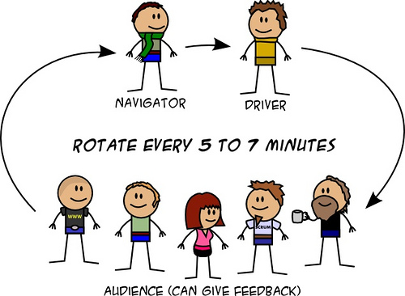
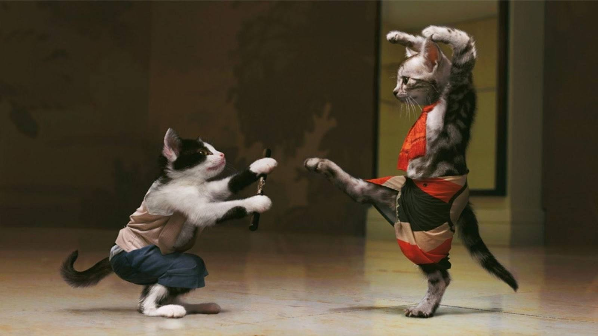
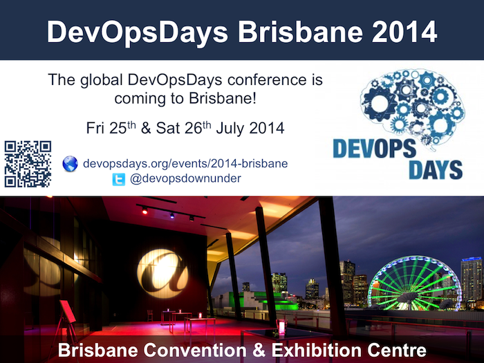

class: center, middle, inverse

---
class: center, middle, inverse

<!-- Non-competitive, collaborative, fun environment
All skill levels are welcome
Safe to try new ideas -->

---
class: center, middle
# .red.bold[Fibonacci Calculator]

computes nth Fibonacci number for a given integer n

##Fibonacci Sequence

###.left[The Fibonacci Sequence is the series of numbers: 
0, 1, 1, 2, 3, 5, 8, 13, 21, 34, ...]

###.left[The next number is found by adding up the two numbers before it. 
For example, the 2 is found by adding the two numbers before it (1+1). Similarly, the 3 is found by adding the two numbers before it (1+2), and the 5 is (2+3), and so on!]

<!-- ---
class: center, middle, inverse
# station 1: .bold[ping-pong]
# station 2: .bold[pomodoro] -->

---
class: center, middle, inverse

# .bold[must] swap the roles
# .bold[must] rotate the pair
# .bold[must] have tests (TDD)

---
class: center, middle, inverse

# defining requirements (10 minutes) -> 
# writing code (25 minutes) -> 
# testing (10 minutes) -> 
# retrospective (10 minutes)
<!-- quick retrospective of the previous session; what went well, what was interesting, what was frustrating -->

---
class: center, middle, inverse
# defining requirements

---
class: center, middle, inverse
# writing code

---
class: center, middle, inverse
# retrospective

---
class: center, middle, inverse
# start coding dojo at work from next week!

---
class: center, middle, inverse
# 
