class: center, middle, inverse

# pairing
.footnote[[ThoughtWorks & Wotif]()]
<!-- it is primarily used in software development but can also be used in business analysis, writing documentation and etc. It can be used anywhere at all.  It is a very useful practice. -->
---
class: center, middle, inverse
# What is pair programming?

<!--   Or, one drives and the other navigates, swapping regularly. The motivation is higher quality output from the outset.
-->

---
class: center, middle, inverse
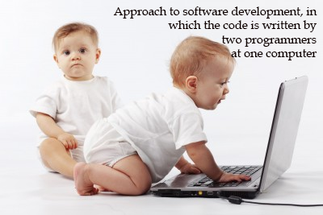

---
class: center, middle, inverse
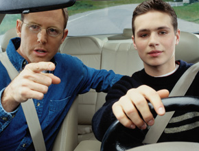

<!--  Or, one drives and the other navigates, swapping regularly. The motivation is higher quality output from the outset.
-->

---
class: center, middle, inverse
# Why some love it?

---
class: center, middle, inverse
# Economies of scale

---
class: center, middle, inverse
# Satisfaction

---
class: center, middle, inverse
# Knowledge sharing
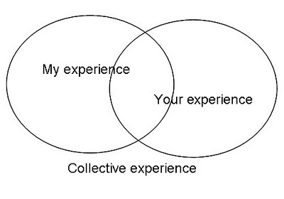
---
class: center, middle, inverse
# Collaboration
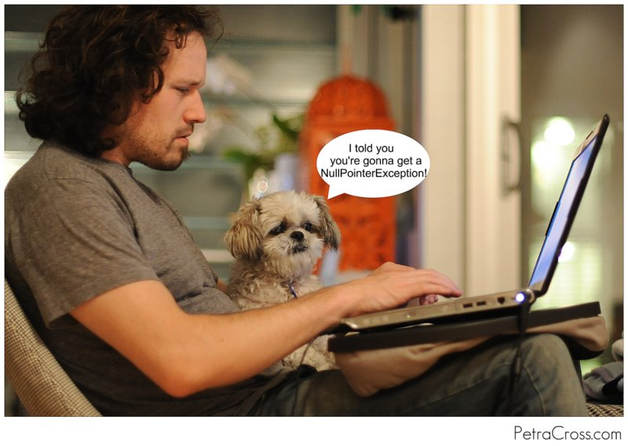
---
class: center, middle, inverse
# Quality
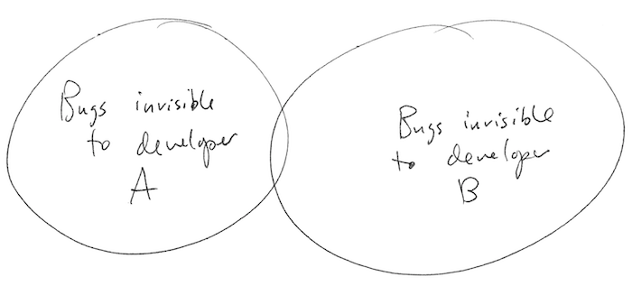

<!-- Some things are best done alone, like changing a light bulb and taking selfies. Other activities, however, lend themselves to a group dynamic. Programming, for example, may seem like a solitary operation, but more and more organizations are seeing the benefits of pair programming
 -->

---
class: center, middle, inverse
# Why some hate it? <!-- Why Does Everyone Hate Pairing -->

---
class: center, middle, inverse
# waste of resource?

<!-- it isn’t just a technique where one person programs and the other person watches. It’s much slower. Talking through approaches and trying to agree on an implementation takes up a fair amount of time. Sometimes you just want to knuckle down get something done - not gonna happen. Obviously the two people could be programming in parallel on different problems. -->

---
class: center, middle, inverse
# privacy invasion
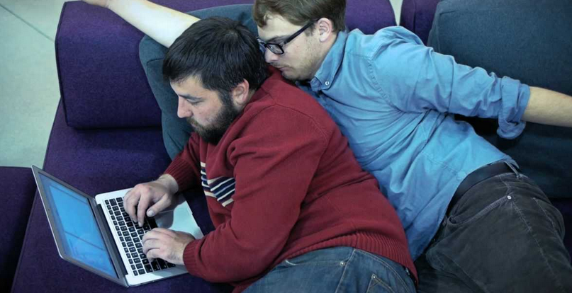
<!-- Sometimes we all need a little space and a little room to breath for whatever reason. It’s hard to get any if you have to pair all day everyday.  -->

---
class: center, middle, inverse
# sharing is awful; and hygenie!
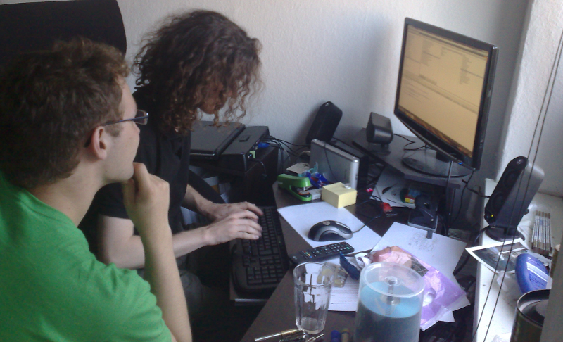
<!-- Sharing computers and desks is awful. What if everyone needs to use the computer at lunch time and there are not enough to go around?1 What if you have carefully configured some apps on one machine but someone else is using it today? -->

<!-- Some people are not as hygienic as others and you will be using the same keyboard and mouse - be prepared to share coughs and colds. Some people are tidier than others, leaving food and other things on the desk is no problem if it’s your desk but can be quite annoying for others. -->

---
class: center, middle, inverse
# "style" clash
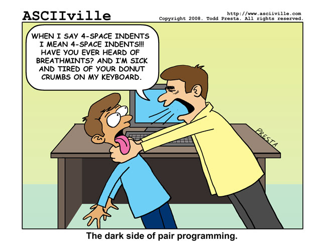
 <!-- personality or coding. not everyone's cup of tea. The simple fact is not everyone gets along. Be it personality or programming style - working on something and having a lot of disagreements is not much fun. -->

---
class: center, middle, inverse
# boring <!-- one drives whereas the other one just stares at the screen -->

---
class: center, middle, inverse
# "new people"
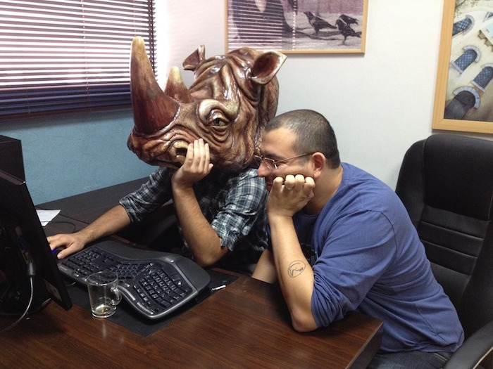

<!--  You need to be especially careful when hiring new people. It’s very hard to gage how someone will fare day to day in an interview and even harder to gage how they well they work with others. Hiring slightly the wrong person can ruin a team’s flow. -->

---
class: center, middle, inverse
# pairing makes you a better person

---
class: center, middle, inverse
# Signs to watch out for good pairing

---
- greasy finger-marks on the screen and loud conversation <!-- (communication) -->

- "No, let me show you what I mean." <!-- ( "expert programmer theory" - where the members of the pair perceive each other as knowledgeable problems are solved more effectively)
 -->

- "Oh, you’ve left out the comma here" <!-- (Notice More Details. the person who isn’t typing code always picks up typos quicker) -->

- "Are we heading in the right direction?"

---
class: center, middle, inverse
# Techniques to try

---
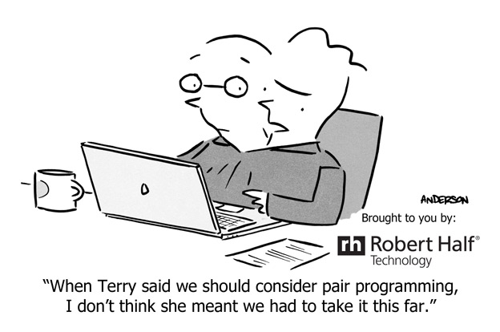

---

- pomodoro

- ping-pong

- parallel pairing

- baby steps

---
class: center, middle, inverse
# Things to avoid?

---
class: center, middle, inverse
# mentor-apprentice

---
class: center, middle, inverse
# unequal access to keyboard and/or screen
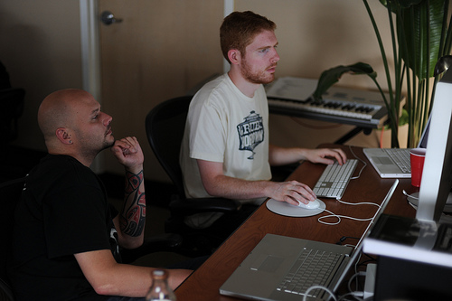

---
class: center, middle, inverse
# keyboard domination
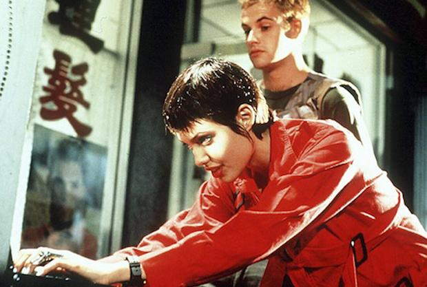

---
class: center, middle, inverse
# pair marriages/no switching during story
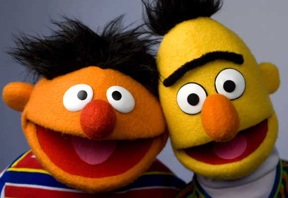

---
class: center, middle, inverse
# worker/rester pairing
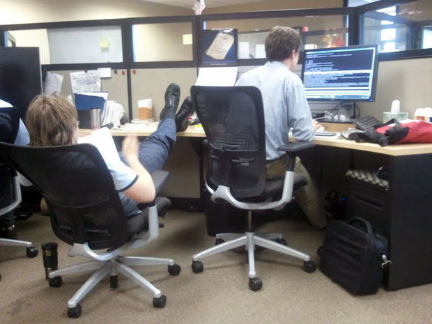

---
class: center, middle, inverse
# 'everyone does their own work'
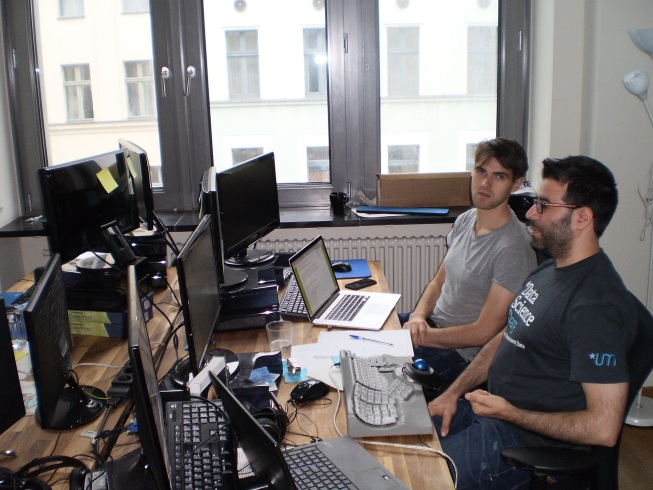

---
class: center, middle, inverse
# debates lasting longer than 10 minutes with no new code
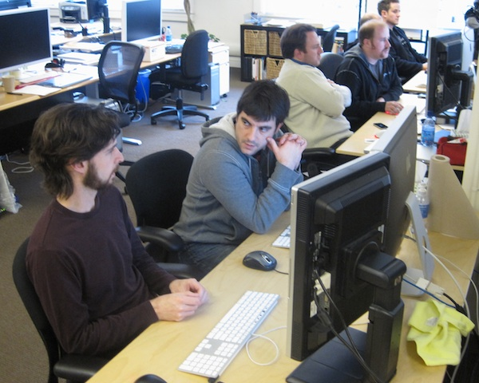

<!-- But be careful to avoid using the technique in a mentor-apprentice sort of way. -->

---
class: center, middle, inverse
# Pair programming is a social skill

---
class: middle

- Realise that it is a hard thing to do!

- Not everyone is born with the skill. you need to learn if you want it to be effective

- It will take time to pay off

<!-- it is a cooperative relationship that takes time to hone but ultimately pays off. As one blogger puts it, it’s a social skill that takes some getting used to. But like all acquired skills, once you’ve developed a taste, there’s no turning back. -->

---
class: center, middle, inverse

