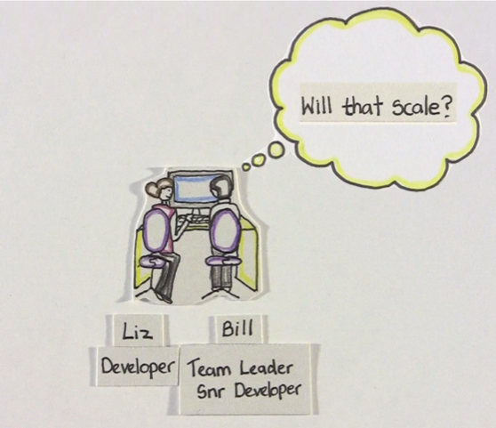
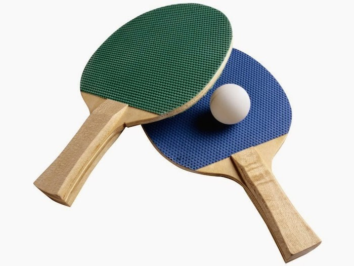
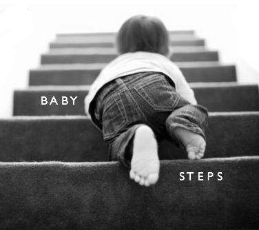
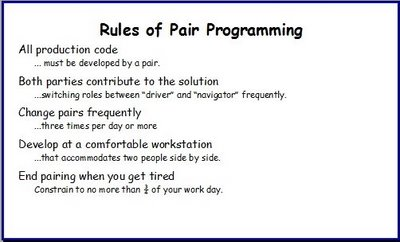
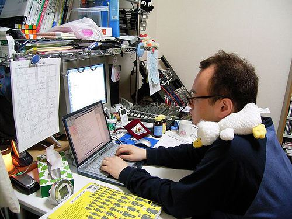

class: center, middle, inverse

# pairing
.footnote[[[ThoughtWorks & Wotif]]()]

<!-- it is primarily used in software development but can also be used in business analysis, writing documentation and etc. It can be used anywhere at all.  It is a very useful practice. Programming is often something that is done in solitude. Problem solving is something that often is done in a group.  Programming is always about problem solving. It would therefore be natural to do programming in groups. The group must not be too large and there must be at least two persons to make up a reasonable group. A pair turns out as the natural choice.

Some of the benefits with pair programming are 
Problem solving
Continuous reviews
Quality
Learning
Lower project risks
Satisfaction

There is also a myth that pair programming is twice as expensive as having one person solve each problem. I will show why this is just a myth and that the actual direct cost has been shown to be 15% higher. I will also follow up and show why the total cost during a computer programs life cycle gets significantly lower with pair programming.

Pair programming is most efficient when the pair sits next to each other. This is not always possible. I will therefore perform a pair programming session with a remote partner to illustrate that it is possible to do pair programming remote.
-->
---
class: center, middle, inverse
# What is pair programming?

<!--   Or, one drives and the other navigates, swapping regularly. The motivation is higher quality output from the outset.
-->
<!-- 

class: center, middle, inverse
 -->

---
class: center, middle, inverse

<!--  Or, one drives and the other navigates, swapping regularly. The motivation is higher quality output from the outset.
-->
---
class: center, middle, inverse
# How does it work?

---
class: center, middle, inverse
# Why do you love pairing?

---
class: center, middle, inverse
# Economies of scale

---
class: center, middle, inverse
# Satisfaction

---
class: center, middle, inverse
# Knowledge sharing

---
class: center, middle, inverse
# Collaboration

---
class: center, middle, inverse
# Quality

<!-- Some things are best done alone, like changing a light bulb and taking selfies. Other activities, however, lend themselves to a group dynamic. Programming, for example, may seem like a solitary operation, but more and more organizations are seeing the benefits of pair programming
 -->

---
class: center, middle, inverse
# Killing Me Softly - with this Pair

---
class: center, middle, inverse
# a video https://www.youtube.com/watch?v=IISUO7MzDS0

---
class: center, middle, inverse
# privacy invasion

<!-- Sometimes we all need a little space and a little room to breath for whatever reason. It’s hard to get any if you have to pair all day everyday.  -->

---
class: center, middle, inverse
# waste of resource

<!-- it isn’t just a technique where one person programs and the other person watches. It’s much slower. Talking through approaches and trying to agree on an implementation takes up a fair amount of time. Sometimes you just want to knuckle down get something done - not gonna happen. Obviously the two people could be programming in parallel on different problems. -->

---
class: center, middle, inverse
# sharing is awful... and hygenie!

<!-- Sharing computers and desks is awful. What if everyone needs to use the computer at lunch time and there are not enough to go around?1 What if you have carefully configured some apps on one machine but someone else is using it today? -->

<!-- Some people are not as hygienic as others and you will be using the same keyboard and mouse - be prepared to share coughs and colds. Some people are tidier than others, leaving food and other things on the desk is no problem if it’s your desk but can be quite annoying for others. -->

---
class: center, middle, inverse
# "style" clash

 <!-- personality or coding. not everyone's cup of tea. The simple fact is not everyone gets along. Be it personality or programming style - working on something and having a lot of disagreements is not much fun. -->

---
class: center, middle, inverse
# boring <!-- one drives whereas the other one just stares at the screen -->

---
class: center, middle, inverse
# "new people"

<!--  You need to be especially careful when hiring new people. It’s very hard to gage how someone will fare day to day in an interview and even harder to gage how they well they work with others. Hiring slightly the wrong person can ruin a team’s flow. -->

---
class: center, middle, inverse
# pairing makes you a better person

---
class: center, middle, inverse
# Signs to watch out for good pairing

---
class: center, middle, inverse
# greasy finger-marks on the screen and loud conversation <!-- (communication) -->

---
class: center, middle, inverse
# "No, let me show you what I mean."

<!-- ( "expert programmer theory" - where the members of the pair perceive each other as knowledgeable problems are solved more effectively)
 -->

---
class: center, middle, inverse
# "Oh, you’ve left out the comma here" 
<!-- (Notice More Details. the person who isn’t typing code always picks up typos quicker) -->

---
class: center, middle, inverse
# "Are we heading in the right direction?"

---
class: center, middle, inverse
# Techniques to try

---

---
class: center, middle, inverse
# pomodoro

<!-- The Pomodoro Technique is a time management method developed by Francesco Cirillo in the late 1980s.[1] The technique uses a timer to break down work into intervals traditionally 25 minutes in length, separated by short breaks. These intervals are known as "pomodori", the plural of the Italian word pomodoro for "tomato".[2] The method is based on the idea that frequent breaks can improve mental agility.[3][4] -->

---
class: center, middle, inverse
# ping-pong

<!-- TDD. We find that this method keeps both programmers in focus (or at least exposes "blackouts" early). -->

---
class: center, middle, inverse
# baby steps

<!-- 
Setup a timer for 2 minutes interval when you start.
Write exactly one test
If the timer rings and the test is red then revert and start over.
If the test is green before timer rings then commit.
Restart timer (no discussions in between timers)
Refactor
If the timer rings and the refactoring is not complete then revert and start over.
If the refactoring is complete before the timer rings then commit.
Restart the timer (no discussions in between timers)
Go to 3.
When session time is up delete the code. -->
---
class: center, middle, inverse
# parallel pairing (use with caution!)

<!-- a pair works on the same story. the pair splits the story into many little tasks and divide between them. the pair sits together and starts to work on them. the pair constantly check on each other's progress. the natural the story is supposed to the smallest unit so the pair really need to work very closely. But if you aren't discipline well, you tend to fall into two people working on their own -->

---
class: center, middle, inverse
# Need rules?

---
class: center, middle, inverse
# Things to avoid?

---
class: center, middle, inverse
# mentor-apprentice

---
class: center, middle, inverse
# unequal access to keyboard and/or screen

---
class: center, middle, inverse
# keyboard domination

---
class: center, middle, inverse
# pair marriages/no switching during story

---
class: center, middle, inverse
# worker/rester pairing

---
class: center, middle, inverse
# "everyone does their own work"

---
class: center, middle, inverse
# debates lasting longer than 10 minutes with no new code

<!-- But be careful to avoid using the technique in a mentor-apprentice sort of way. -->

---
class: center, middle, inverse
# Pair programming is a social skill

---
class: middle, middle, inverse

#Realise that it is a hard thing to do! 
# Not everyone is born with the skill. You need to learn if you want it to be effective. 
# It will take time to pay off

<!-- it is a cooperative relationship that takes time to hone but ultimately pays off. As one blogger puts it, it’s a social skill that takes some getting used to. But like all acquired skills, once you’ve developed a taste, there’s no turning back. -->

---
class: center, middle, inverse

---
class: center, middle, inverse
# demo
[Problem: convert roman numerals]

---
class: center, middle, inverse

---
class: center, middle, inverse
# Pairing is great, go back to your project and try to pair on your next piece of work!

